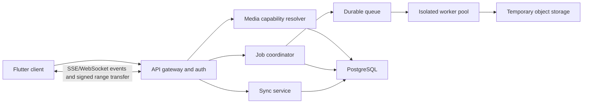

# Kurama Unified Media Hub Design

Date: 2026-08-12

Status: Approved design, pending implementation-plan approval

Primary client: Flutter

Backend: Official Kurama-managed service

## 1. Executive summary

Kurama will evolve from a media-downloader application into a stable, cross-platform media hub that combines:

- an embedded browser and shared-link intake;
- permitted-source media detection and resumable downloads;
- a cinematic video library and player;
- a focused music library and player;
- automatic local-media discovery after permission is granted;
- reliable offline playback and download recovery;
- guest-first operation with optional account synchronization; and
- a Kurama-managed backend configured by default.

The product remains local-first. Local playback, the library, queues, playlists, downloads already transferred to the device, and the private vault must continue to work when the backend is unavailable and when the user has no account. Signing in adds cross-device continuity; it does not unlock basic playback.

The implementation will preserve useful foundations in the current repository while replacing fragile persistence, authentication, state-management, and backend boundaries. The work is divided into four implementation phases so each phase can be released and tested without requiring the entire product to be rebuilt at once.

## 2. Current codebase assessment

### 2.1 Foundations to preserve

The repository already contains working pieces that should be adapted rather than rewritten without cause:

- Flutter application shell and Material 3 foundation.
- Android and iOS platform scaffolding.
- Embedded browser and page-media detection.
- Video playback through `video_player` and `chewie`.
- Audio playback and background audio through `just_audio`.
- Background work, notifications, sharing, permissions, connectivity, and file picking.
- Encrypted vault, secure key storage, and local authentication.
- FastAPI endpoints for metadata, job creation, progress, retry, and file delivery.
- Server-Sent Events for progress and HTTP byte-range support for resumed transfer.
- Cross-component, API, release, branding, and repository-boundary tests.

### 2.2 Limits that block the target product

The following issues require targeted architectural change:

- `mobile/lib/main.dart` owns theme, bootstrap, navigation, endpoint selection, and notification routing.
- `AppState` is a global download list rather than a product state boundary.
- Screens and services mix presentation, network, storage, and orchestration responsibilities.
- Download history and user state rely on `SharedPreferences`; backend user and task state rely on JSON and process memory.
- The client uses a shared API key and exposes server configuration as a user-facing repair path.
- The production URL still refers to the previously combined Telegram service.
- Backend download, profile, billing, task, file, and administrative concerns share one large module.
- In-process workers and temporary files make restart and horizontal scaling behavior fragile.
- Local-media intake is manual file import rather than a permission-aware index.
- Some model and platform metadata still use emoji as structural icons.
- The README promises Android and Windows while the checked-in platform scaffolding and release guarantees are incomplete for the broader cross-platform goal.

The redesign addresses these limits only where they serve the media-hub goal. It does not perform unrelated repository refactoring.

## 3. Product principles

1. **Local-first:** local and completed media never depend on the backend for playback.
2. **Guest mode is complete:** users can browse local media, play it, build queues, manage downloads, and use the vault without creating an account.
3. **Cloud is additive:** sign-in adds synchronization, recovery, and multi-device continuity.
4. **Progress is durable:** restarts, lost connectivity, expired sources, and low storage preserve completed work and user intent.
5. **One catalog:** local files, completed downloads, and online entries share one normalized media model.
6. **Platform behavior is explicit:** native capabilities live behind platform adapters rather than conditional logic scattered through screens.
7. **Accessible by construction:** semantic labels, 48 dp touch targets, visible focus, dynamic text, reduced motion, and non-color status indicators are acceptance criteria.
8. **User authorization is required:** Kurama does not bypass DRM, access controls, paywalls, or platform restrictions. Downloading is limited to content the user is authorized to save and sources the service is permitted to process.

## 4. Scope

### 4.1 Included

- Lacquer & Gold adaptive application shell.
- Home, Explore, Library, Downloads, and Profile navigation.
- Globe/browser symbol for Explore; search remains an action inside relevant screens.
- Embedded browser, URL intake, clipboard/share intake, and supported-media detection.
- Unified video, music, downloads, and local-media catalog.
- Cinematic landscape video player.
- Thumb-first portrait music player with queue, repeat, shuffle, speed, sleep timer, and offline state.
- Automatic accessible-media scan after permission is granted.
- Manual file/folder intake and rescan controls.
- Resumable downloads with pause, retry, cancellation, storage recovery, and source refresh.
- Guest/device identity and optional user account.
- Synchronization of progress, playlists, favorites, preferences, and download history.
- Encrypted private vault using platform-secure keys.
- Managed authentication, metadata resolution, job coordination, workers, progress events, and operational controls.
- Android, iOS, and Windows as first-class release targets.
- macOS and Linux after platform-adapter parity tests pass.

### 4.2 Explicitly excluded from the first stable release

- A full web client with native feature parity. Web may later provide a limited streaming and account surface, but browser sandboxing prevents equivalent embedded browsing, background downloads, and automatic local-media access.
- DRM bypass, credential theft, paywall bypass, or unauthorized copying.
- Automatic upload of local media files.
- Social feeds, chat, public profiles, comments, or creator monetization.
- Billing, download credits, subscriptions, and payment-receipt processing in the first stable media-hub release. The legacy endpoints are isolated during Phase 0 and removed from the public application boundary unless monetization receives a separate approved design.
- A plugin marketplace or arbitrary third-party executable extensions.
- Server-side permanent media storage by default. Backend transfer artifacts use short retention unless the user owns or explicitly stores eligible media.

## 5. Experience design

### 5.1 Visual system

The approved direction is **Lacquer & Gold**:

- near-black ink background;
- deep lacquer-red elevated surfaces;
- functional gold for playback progress, focus, confirmed selection, and primary actions;
- ivory primary text and warm gray secondary text;
- green, amber, and red reserved for semantic status and always paired with text or iconography;
- restrained asymmetric corners and subtle depth;
- vector-only icons with a consistent stroke family; and
- 150-300 ms state transitions with a reduced-motion alternative.

Gold is functional, not decorative noise. It identifies progress, focus, confirmed state, or the primary action.

The video-library and music-library experiences use familiar cinematic and audio-player interaction conventions, but they do not copy Netflix, Spotify, or any other service's branding, assets, proprietary content model, or protected playback behavior.

### 5.2 Navigation

Phone navigation contains no more than five destinations:

1. Home
2. Explore, represented by a globe/browser icon
3. Library
4. Downloads
5. Profile

Vault remains accessible from Library and Profile instead of occupying a permanent navigation slot. Tablets and desktops use an adaptive rail or sidebar while preserving the same destination order and deep links.

### 5.3 Home

Home prioritizes continuation and local availability:

- Continue watching/listening.
- Recently added local and downloaded media.
- Download status requiring attention.
- Quick access to Explore and local scan.
- Connection/backend health shown as a quiet status, not a blocking banner.

An unavailable backend must not replace Home with a failure screen.

### 5.4 Explore and browser

Explore opens the browser surface rather than a search-only page. It provides:

- address and search input;
- browser controls, tabs, bookmarks, and history appropriate to the platform;
- detected-media action anchored to the current page;
- pasted/shared URL intake;
- capability feedback before download choices; and
- a clear distinction between playable online media and downloadable authorized media.

Detection must never imply that Kurama can bypass protected playback. Unsupported or protected sources receive a concise explanation and safe alternatives such as opening in the source application.

### 5.5 Unified library

The library offers Videos, Music, Playlists, Local, and Vault views over one catalog. Every item carries its origin and availability:

- local file;
- completed download;
- online reference;
- vaulted file; or
- unavailable/missing file.

Filters and sorting never duplicate media records. A single item may have multiple locations, such as a remote reference plus a verified local copy.

### 5.6 Video player

The approved video player uses a 16:9 immersive canvas with quiet overlay controls:

- back, cast, picture-in-picture, and overflow actions;
- play/pause and ten-second seek controls;
- timeline with played and buffered states;
- remaining time and elapsed/total time;
- captions, audio track, quality, and fullscreen;
- brightness and volume gestures with visible feedback; and
- controls that fade after three seconds and return on tap.

All gestures have button or system alternatives. Controls respect safe areas, keyboard input, screen readers, dynamic text, and reduced motion.

### 5.7 Music player

The approved music player uses a portrait layout with artwork in the upper half and transport controls in the lower thumb-reachable half. It includes:

- track, artist, album, and availability;
- favorite state;
- scrubber and time labels;
- shuffle, previous, play/pause, next, and repeat;
- queue, offline state, sleep timer, and speed;
- Up Next preview; and
- background audio and system media controls.

Secondary tools must not compete visually with play/pause.

### 5.8 Downloads and recovery

The download manager displays storage usage, active progress, queue state, speed, ETA, and preserved progress. Required states are:

- pending;
- resolving;
- downloading;
- paused by user;
- waiting for network;
- waiting for Wi-Fi policy;
- waiting for storage;
- source refresh required;
- verifying;
- completed;
- failed with a recovery action; and
- cancelled.

Every error states what happened, what was preserved, and the next safe action. Low storage offers storage review and location change. Expired source state preserves transferred data and requests a source refresh. Restart recovery reconciles local and server state instead of resetting to zero.

### 5.9 Guest identity and accounts

On first launch the app creates a private device identity. Guest mode supports the complete local/offline product. Account sign-in enables:

- cross-device progress and playlist synchronization;
- preference backup;
- download-history continuity; and
- device management.

Local paths and file bytes are never synchronized automatically. The account screen must state this directly.

## 6. Target client architecture

The Flutter application is organized by feature with a shared domain core.

```text
mobile/lib/
  app/                 bootstrap, routing, theme, dependency composition
  core/                errors, result types, logging, networking, database
  domain/              media, playback, downloads, identity, sync contracts
  features/
    home/
    explore/
    library/
    player/
    downloads/
    vault/
    profile/
  platform/            media index, file access, background jobs, secure store
```

### 6.1 Dependency rule

Presentation depends on feature controllers. Feature controllers depend on domain use cases and repository interfaces. Infrastructure implements repository interfaces. Domain code does not import Flutter widgets, HTTP clients, SQLite packages, or platform channels.

Screens do not call `SharedPreferences`, HTTP, file-system APIs, or platform plugins directly.

### 6.2 State management

The existing global `AppState` is replaced incrementally with feature-scoped controllers. Provider may remain during migration; a state-management library change is not required to achieve the boundary.

Required controllers include:

- `HomeController`
- `ExploreController`
- `LibraryController`
- `PlaybackController`
- `DownloadController`
- `IdentityController`
- `SyncController`
- `VaultController`

Playback and downloads are application-scoped services with feature-specific projections. UI state is immutable and exposes explicit loading, data, empty, and recoverable error forms.

### 6.3 Local persistence

SQLite becomes the local source of truth. The implementation may use Drift for typed schema and migrations. `SharedPreferences` remains only for small non-critical settings such as theme mode and dismissed tips.

Core local tables:

- `media_items`
- `media_locations`
- `artists`
- `albums`
- `playlists`
- `playlist_items`
- `playback_positions`
- `download_jobs`
- `download_segments`
- `sync_outbox`
- `devices`
- `schema_metadata`

Media file paths are stored only locally. Sensitive vault metadata is encrypted or stored behind the vault boundary.

### 6.4 Platform adapters

Platform-specific capabilities use interfaces with per-platform implementations:

- `MediaIndexAdapter`
- `FileAccessAdapter`
- `BackgroundJobAdapter`
- `NotificationAdapter`
- `SecureKeyAdapter`
- `NativePlaybackAdapter`
- `BrowserAdapter`
- `ShareIntentAdapter`

Android uses MediaStore/scoped storage. iOS uses user-selected or permitted media-library/file-provider access. Windows uses known media folders and explicit folder grants. macOS and Linux ship only after their adapters pass the same contract suite.

### 6.5 Automatic media discovery

The app requests platform-appropriate permission with a clear explanation. After permission is granted, it automatically scans all accessible media without requiring a second action. The scan:

1. enumerates accessible audio and video through the platform adapter;
2. computes a stable platform identifier and lightweight fingerprint;
3. extracts metadata and artwork off the UI thread;
4. upserts catalog records and locations transactionally;
5. marks missing locations without immediately deleting user metadata; and
6. emits incremental progress for large libraries.

The user can rescan, choose additional folders where supported, revoke access, and disable automatic refresh. Scan cancellation preserves indexed results.

## 7. Domain model

### 7.1 Media item

A `MediaItem` represents logical content and includes:

- stable local UUID;
- type: video, episode, movie, track, or unknown media;
- title, subtitle, duration, artwork, and extracted metadata;
- availability summary;
- optional remote/source reference; and
- timestamps for creation, update, and last playback.

One item can have multiple `MediaLocation` records:

- local file;
- vaulted file;
- completed download;
- partial download; or
- remote stream reference.

### 7.2 Download job

A `DownloadJob` has a stable client-generated idempotency key and a separate server job ID. It stores requested format, quality, policy, state, byte counts, verified segments, source-expiry state, local destination, retry count, and timestamps.

State transitions are validated in the domain layer. Terminal failure does not delete partial data. Cancellation is explicit and may remove partial data only after user confirmation or retention expiry.

### 7.3 Playback session

A `PlaybackSession` contains queue order, current item, position, speed, repeat mode, shuffle seed, audio/subtitle selections, and output route. Position writes are debounced locally and added to the sync outbox when account sync is active.

## 8. Managed backend architecture

The backend separates synchronous API work from durable background jobs.



### 8.1 Services

- **API gateway and authentication:** device sessions, user sessions, authorization, rate limits, request IDs, and version negotiation.
- **Media capability resolver:** URL normalization, supported-source policy, metadata extraction, format options, and protected-source rejection.
- **Job coordinator:** idempotent creation, state transitions, retry policy, ownership, retention, and signed transfer preparation.
- **Worker pool:** isolated media jobs with CPU, memory, duration, and network limits.
- **Sync service:** progress, favorites, playlists, preferences, and device merge.
- **Operations:** health, metrics, tracing, audit events, worker capacity, and remote disabling of broken source adapters.

### 8.2 Durable data

- PostgreSQL stores users, devices, sync records, job metadata, source capability records, and audit metadata.
- A managed queue/cache stores leases, short-lived events, rate limits, and worker coordination.
- Object storage holds short-lived transfer artifacts and eligible user-owned stored media only when explicitly requested.
- All persistent records have ownership and retention policies.

The existing JSON user configuration, process-global task dictionary, and local temporary-task manifest are migrated behind repositories before being removed.

### 8.3 Authentication

The static shared API key is removed from the released client.

- First launch obtains a short-lived guest/device session from an attested installation flow where supported.
- User sign-in upgrades or links the device session without losing local state.
- Refresh credentials are stored in the platform secure store.
- Access tokens are short-lived and scoped.
- Administrative endpoints require a separate staff identity and are never accessible with a user token.
- Server base URL is supplied through release configuration, not a normal user setting.

Developer builds may support an explicit local-backend override behind a development flag.

### 8.4 API contracts

Versioned API groups:

- `/v1/session`
- `/v1/media/resolve`
- `/v1/downloads`
- `/v1/downloads/{id}/events`
- `/v1/downloads/{id}/transfer`
- `/v1/sync/pull`
- `/v1/sync/push`
- `/v1/devices`
- `/v1/health`

Download creation requires a client idempotency key. Transfer endpoints support byte ranges and signed, expiring authorization. Error responses contain a stable machine code, human message, retryability, and optional recovery action.

## 9. Core data flows

### 9.1 Local media

Permission grant -> platform media index -> metadata extraction -> transactional catalog upsert -> Library -> Player.

No backend call is required. Local media bytes are never uploaded automatically.

### 9.2 Online detection and download

Share/paste/browser detection -> URL normalization -> managed capability check -> format choice -> idempotent job -> progress events -> signed resumable transfer -> local checksum/verification -> catalog location -> Player.

If the backend becomes unavailable after transfer begins, the client preserves received segments and enters a waiting state. When service returns, it reconciles server byte availability and resumes from the last verified boundary.

### 9.3 Playback

Library selection -> resolve best playable location -> create/replace playback session -> open native player -> persist local position -> optionally queue sync event.

Resolution order prefers verified local/vault/download locations over remote references unless the user explicitly chooses streaming.

### 9.4 Account synchronization

Local mutation -> commit locally -> append outbox record in the same transaction -> background push -> server acknowledgement -> outbox compaction.

Server changes are pulled by cursor. Conflicts use field-specific rules:

- playback position: most recently played event wins, with completion never regressing to an early accidental seek;
- favorites: latest explicit user action wins;
- playlists: operation-based insert, remove, and reorder merge;
- preferences: latest device timestamp with server monotonic ordering; and
- local locations: never synchronized as portable file paths.

## 10. Reliability and recovery

### 10.1 Client guarantees

- Local database migrations are transactional and backed up before destructive schema changes.
- Download state is persisted before work starts and after every meaningful state transition.
- Segment verification prevents corrupt resumes.
- App restart triggers job reconciliation, not blanket failure.
- Missing files are marked unavailable and recoverable rather than deleting catalog metadata immediately.
- Background and foreground transfer code share a single lease per destination file.
- Playback position writes are bounded and crash-safe.

### 10.2 Backend guarantees

- Job creation is idempotent.
- Workers use leases with expiry and heartbeat.
- Retryable and terminal failures are distinct.
- Queue messages may be delivered more than once; handlers remain idempotent.
- Worker restart returns leased jobs to the queue after lease expiry.
- Transfer artifacts use checksums and retention policies.
- Broken source adapters can be disabled remotely without an application release.

### 10.3 Recovery UX

Required recovery actions include retry, resume, refresh source, wait for Wi-Fi, review storage, change destination, choose another format, open in source app, and report an issue. Errors are announced to assistive technology and appear beside the affected item.

## 11. Security, privacy, and compliance

- No release API keys are embedded in the client.
- Tokens and vault keys use platform-secure storage.
- Backend authorization checks resource ownership on every job, transfer, sync, and device endpoint.
- Resolver requests block private-network targets, unsafe redirects, unsupported schemes, oversized responses, and DNS rebinding.
- Worker execution uses network, time, disk, CPU, and memory limits.
- Cookie import or account credential collection is not part of the stable product design.
- Local file access is permission-scoped and revocable.
- Local media bytes remain device-local unless the user explicitly invokes an eligible upload feature added in a later reviewed design.
- Telemetry excludes URLs, filenames, media titles, local paths, tokens, and content by default.
- Logs use request IDs, job IDs, source category, error code, duration, and byte counts without recording sensitive content.
- The UI and backend state that users must have rights to download requested content.
- Protected streams, DRM, paywalls, and access-control bypass are rejected.

## 12. Performance and service objectives

Initial release objectives:

- App shell interactive within 2 seconds on supported mid-range devices after warm start.
- Local library first page visible within 500 ms after database open.
- Incremental scanning: first discovered items appear before a large scan completes.
- UI remains responsive during metadata extraction and scanning.
- Local playback startup p95 below 1 second for supported files on healthy storage.
- Download progress freshness below 2 seconds while connected.
- API availability target of 99.9% monthly after managed production launch.
- Job creation p95 below 1 second, excluding source metadata resolution.
- No loss of verified download progress across normal app or worker restart.

These objectives are measured by tests and telemetry before each target moves from beta to stable.

## 13. Accessibility and adaptive layout

- Interactive targets are at least 44 pt on iOS and 48 dp on Android.
- Primary text contrast is at least 4.5:1; secondary text and large controls are at least 3:1.
- Status is never communicated by color alone.
- Screen-reader order follows visible order and every icon control has a descriptive label.
- Dynamic text reflows without clipped actions.
- Reduced motion removes nonessential movement and preserves state meaning.
- Keyboard shortcuts cover desktop playback, browsing, and navigation.
- Safe areas and system bars are respected.
- Layout tests cover 375 px phones, large phones, tablets, desktop windows, portrait, and landscape.
- Long lists use lazy construction and stable item keys.

## 14. Testing strategy

### 14.1 Client

- Domain unit tests for catalog merging, availability selection, download state transitions, queue behavior, sync conflict rules, and recovery decisions.
- Repository contract tests run against in-memory and SQLite implementations.
- Platform-adapter contract tests with fakes plus device integration tests.
- Widget tests for every loading, empty, offline, success, and recovery state.
- Golden tests for Lacquer & Gold phone, tablet, desktop, and largest-text layouts.
- Player tests for queue, seek, speed, captions, background audio, interruption, and position restoration.
- Download tests for restart, pause/resume, duplicated intents, range mismatch, low storage, and corrupted partial files.
- Accessibility checks with TalkBack, VoiceOver, keyboard navigation, and reduced motion.

### 14.2 Backend

- Unit tests for URL safety, source capability policy, state transitions, retention, and authorization.
- API contract tests generated from the versioned OpenAPI schema.
- Repository tests against PostgreSQL.
- Queue/worker integration tests with duplicate delivery and lease expiry.
- Transfer tests for range requests, checksum failure, expiration, and ownership.
- Load tests for job creation, progress fan-out, and worker concurrency.
- Failure-injection tests for database loss, queue restart, object-storage timeout, worker crash, and source adapter outage.

### 14.3 End-to-end release gates

- Fresh install and migration from the current release.
- Guest local scan and playback with the backend blocked.
- Browser detection through verified local download and playback.
- App termination during transfer followed by successful reconciliation.
- Sign-in after guest usage without local data loss.
- Cross-device playlist and playback-position synchronization.
- Vault round trip with device authentication.
- Signed release checks for every supported platform.

## 15. Observability and operations

The backend emits structured metrics for request latency, resolver outcomes, queue depth, job duration, retry reason, worker capacity, bytes transferred, artifact retention, and error code. Distributed traces connect API request, job, worker, and transfer without including media URLs or titles.

The client records privacy-safe operational events for startup phase, database migration result, scan duration/count, playback failure category, download state transition, and sync outcome. Diagnostics export is user-initiated and redacted.

Operational dashboards and alerts cover:

- authentication failures by release version;
- elevated resolver failure by source adapter;
- queue delay and stuck leases;
- object-storage failures;
- transfer checksum mismatch;
- crash-free sessions; and
- migration failure rate.

## 16. Migration and delivery phases

### Phase 0: Stabilize and split

- Introduce app bootstrap, routing, and semantic theme tokens.
- Adopt Lacquer & Gold without changing core behavior.
- Add domain contracts and repositories around current storage and API code.
- Introduce SQLite and migrate current download/playback data.
- Split FastAPI into routers, services, repositories, and worker interfaces.
- Add API error codes and idempotency keys.
- Preserve existing endpoints through a compatibility adapter during migration.
- Establish Android, iOS, and Windows build/test matrices.

Exit gate: existing download, player, browser, vault, and release tests pass through the new boundaries; migration is reversible for one release.

### Phase 1: Local media hub

- Add the normalized catalog and media-location model.
- Implement permission education and automatic platform media scan.
- Build the approved Home, Library, video player, and music player.
- Add queues, playlists, favorites, progress, artwork, and missing-file recovery.
- Preserve vault compatibility.

Exit gate: all local features work in airplane mode after fresh install and after process termination.

### Phase 2: Browser and durable downloads

- Build the approved Explore/browser surface and detection controller.
- Introduce managed capability resolution and protected-source rejection.
- Add durable server jobs, worker queue, signed transfers, and client reconciliation.
- Build the approved download manager and recovery centre.
- Migrate off the legacy production endpoint and shared client API key.

Exit gate: app and worker restarts preserve verified progress; duplicate requests do not create duplicate jobs or files.

### Phase 3: Accounts and scale

- Add guest/device sessions, user authentication, and account linking.
- Add outbox-based sync and device management.
- Move persistent backend state to PostgreSQL and managed object storage.
- Add operational dashboards, alerts, rate limits, retention, and administrative identity.
- Complete Windows hardening, then macOS/Linux adapters and parity tests.

Exit gate: guest-to-account upgrade preserves all local data; sync conflict and outage tests pass; supported platforms meet crash-free and accessibility release thresholds.

## 17. Acceptance criteria

The unified media hub design is complete when:

1. A user can deny network access and still scan permitted local media, browse the library, play audio/video, manage queues, and use the vault.
2. Granting media permission automatically starts an incremental scan of all accessible media and reports progress without blocking the UI.
3. A user can browse or share a supported authorized source, inspect format choices, start a download, terminate the app, and later resume without losing verified progress.
4. Low storage, network loss, expired source, unsupported source, backend outage, and corrupt partial data each produce an accurate state and recovery action.
5. Guest mode never displays API-key repair instructions and does not require account creation.
6. Sign-in synchronizes eligible metadata without uploading local media bytes or portable local paths.
7. Video and music players meet the approved control layouts, accessibility requirements, background behavior, and adaptive breakpoints.
8. The client contains no production shared secret and administrative APIs reject user sessions.
9. Backend workers may restart or receive duplicate queue messages without duplicating jobs, charging twice, or corrupting output.
10. Android, iOS, and Windows pass the same core domain, repository, accessibility, migration, and end-to-end contract suite before stable release.

## 18. Implementation planning boundary

This document is the umbrella product and architecture specification. The next implementation plan covers **Phase 0: Stabilize and split** only. Phases 1-3 each receive a focused specification review and their own implementation plan after the preceding exit gate passes. This keeps changes reviewable and prevents the broad product goal from becoming one unsafe rewrite.

Every phase plan requires independently reviewable commits, tests, migration notes, and rollback instructions. No plan may treat the UI redesign as a theme-only change or replace the local-first architecture with a cloud-required workflow.
